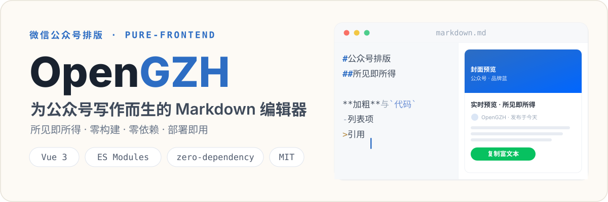
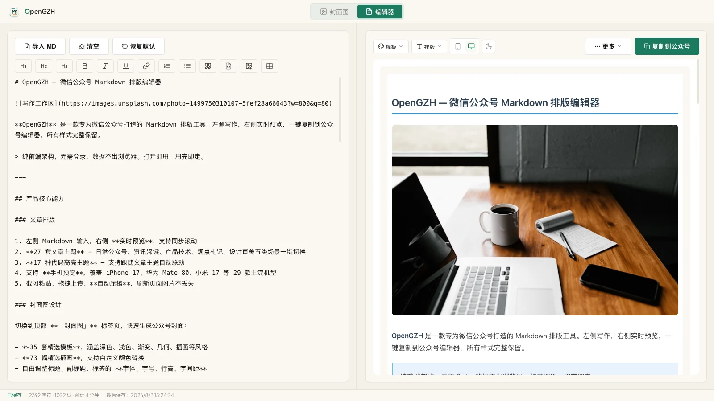
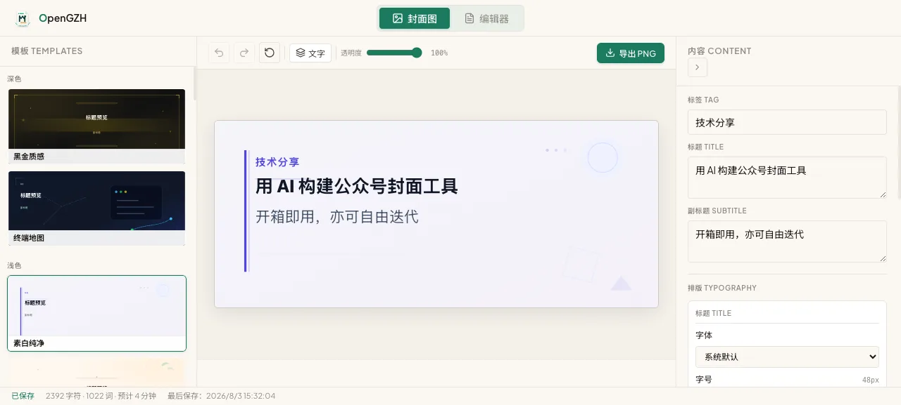
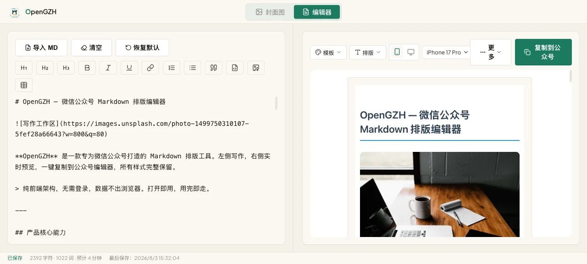
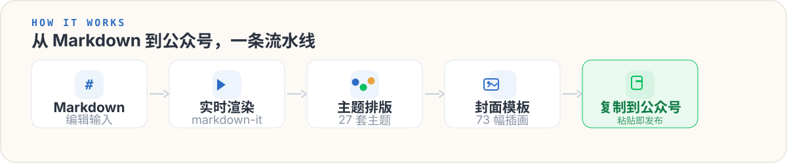

<p align="center">
  
</p>

> 面向微信公众号写作与排版的纯前端 Markdown 编辑器。左侧写 Markdown，右侧实时预览最终排版；图片本地持久化、一键复制富文本，**零构建、零依赖，部署即用**。

---

## 界面一览

<p align="center">
  
</p>

<p align="center">
  
  
</p>

## 核心亮点

| 能力 | 说明 |
| --- | --- |
| 文章主题 | 27 套风格主题，按五类写作场景分类，预览即最终效果 |
| 局部卡片 | 编辑器内置 10 张主题联动卡片，可选区套用、直接插入、换卡和无损移除 |
| 代码高亮 | 17 种高亮方案，随文章主题自动联动 |
| 封面模板 | 47 套封面 + 居中布局 16 款背景 + 73 幅 SVG 插画，场景标签辅助选择 |
| 手机预览 | 29 款机型（含折叠屏），桌面 / 手机一键切换 |
| 数学公式 | LaTeX 渲染，导出自动转 SVG |
| 图片管理 | 拖拽 / 粘贴 / 上传，IndexedDB 本地持久化，不依赖图床 |
| 小红书图文 | 右侧切换「图片」模式，Markdown 自动分页为 3:4 卡片，导出 1080×1440 PNG / ZIP |
| 一键发布 | 复制富文本直达公众号后台，粘贴即发布 |
| 文档管理 | 多文档切换、搜索、自动保存 |

## 小红书图片模式

在编辑器右侧工具栏把预览输出从「文本」切到「图片」，左侧 Markdown 原文保持不变，右侧变为 3:4 卡片堆叠预览：

- **固定 3:4 画布**：预览 540×720，导出的每张 PNG 均为 1080×1440。
- **五套主题 × 三档密度**：极简留白、编辑部杂志、温暖纸张、深色科技、明快知识卡，各支持舒展 / 标准 / 紧凑。
- **语义分页**：标题与后续正文绑定；长段落按句子拆分；列表只在列表项之间拆分；长表格按行分页并重复表头；长代码按行分页并延续行号；图片与公式不可拆分。
- **手动分页**：在左侧光标处或右侧卡片边界插入 `<!-- xhs-page -->`，文本预览与图片成品中均不可见。
- **封面**：第一个 H1 由封面消费；标题、摘要、署名可单独覆盖；可从文章图片中指定封面主视觉并调整 0–100 的视觉焦点。
- **导出**：支持单张 PNG 与整组 ZIP（`01-封面.png`、`02.png`…，无压缩 Store 模式，无需任何运行时依赖）。
- **数据仍在本地**：图片模式设置（主题、密度、目录、封面、焦点等）随文档保存在浏览器本地，不上传任何内容。

导出前会自动校验字体、媒体、溢出、安全区、字号与颜色对比度；任一页失败会阻止整组 ZIP 并定位到具体页，已通过校验的页仍可单张下载。远程图片若无法通过 CORS 安全读取，对应页面会被阻止导出并提示本地化，不会静默丢图。超过 18 张时仅提示「可能超出当前客户端单篇上传能力」，仍会完整导出——18 只是产品警告阈值，不是官方硬性上限。GIF 与视频自动静默截取第一帧。

> 说明：以上能力均为本地生成与导出；「浏览器 / ZIP 验证通过」不代表小红书 App 实际上传验证通过。

## 工作流程

<p align="center">
  
</p>

所有能力都在浏览器内完成：Markdown 经 `markdown-it` 实时渲染，叠加主题与封面后，一键把富文本复制到公众号后台，全程不经过任何服务器。

## 为什么是 OpenGZH

- **所见即所得** —— 预览区就是你粘贴到公众号后的样子，不用反复调试样式。
- **零构建、零依赖** —— 没有 Node、没有构建步骤、没有后端，静态托管即可上线。
- **图片本地化** —— 图片入库自动保存，不依赖图床与外链，防失效。
- **一键发布** —— 富文本带样式直达公众号后台，省去手动排版。

## 快速开始

```bash
# 启动静态服务
python3 -m http.server 8080

# 或使用内置脚本
./start.sh
```

浏览器打开 <http://localhost:8080> 即可使用。

> 在线体验：[opengzh.pasca.fun](https://opengzh.pasca.fun)

## 项目结构

```text
OpenGZH/
├── index.html              # 主编辑器
├── about.html              # 关于页面
├── start.sh                # 本地启动脚本
├── assets/
│   ├── images/             # 图标、Logo、封面插图（200+ SVG）
│   ├── scripts/
│   │   ├── main.js         # Vue 应用入口
│   │   ├── core/           # Markdown 渲染管线
│   │   ├── storage/        # IndexedDB 持久化
│   │   ├── export/         # 导出 / 复制模块
│   │   ├── ui/             # 主题管理、代码主题
│   │   ├── xhs/            # 小红书图片模式（解析、分页、渲染、校验、导出）
│   │   └── cover/          # 封面插图系统
│   └── styles/
│       ├── base.css        # 基础样式 & CSS Variables
│       ├── editor.css      # 编辑器布局
│       ├── panel.css       # 侧边面板
│       ├── cover.css       # 封面插图样式
│       ├── xhs.css         # 小红书卡片主题与工作区样式
│       └── themes/         # 微信公众号主题
└── docs/                   # 设计文档 & PRD
```

## 技术栈

| 层 | 方案 |
| --- | --- |
| 框架 | Vue 3（CDN） |
| Markdown 渲染 | markdown-it |
| 代码高亮 | highlight.js |
| HTML → Markdown | turndown |
| 图片存储 | IndexedDB + Canvas API |
| 模块化 | 原生 ES Modules |
| 样式 | 纯 CSS（CSS Variables 主题系统） |
| 部署 | 纯静态，GitHub Actions → rsync → Nginx |

## 兼容性

需现代浏览器支持：ES Modules · Clipboard API · Fetch · IndexedDB · Canvas API

## License

MIT
